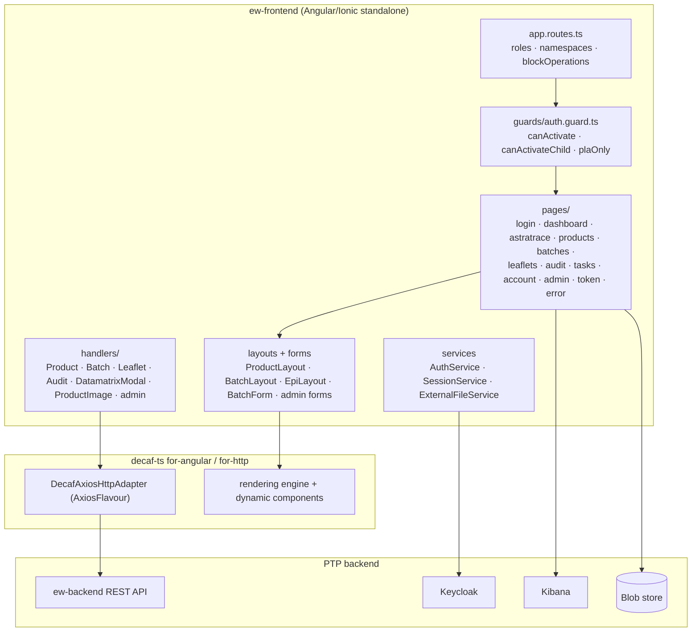

# Architecture

## Stack

* **Angular + Ionic standalone components.** The shell is composed in `app.config.ts`
  with `provideRouter(routes, withComponentInputBinding())`, `provideIonicAngular`, and
  `IonicRouteStrategy`, so the app is a single-page application with Ionic navigation
  primitives and route-parameter input binding.
* **Decaf-ts rendering and persistence.** `provideDecafDynamicComponents` registers the
  reusable renderers (`AppModalDiffsComponent`, `AppLeafletPreviewComponent`,
  `AppSelectFieldComponent`, `AppExpiryDateFieldComponent`,
  `AppExternalFileUploadComponent`, `AppExternalFilePreviewComponent`,
  `AppLeafletItemComponent`), and `provideDecafDbAdapter(DecafAxiosHttpAdapter, …,
  AxiosFlavour)` wires every repository call to the PTP backend (`Environment.ptp.protocol`
  + `Environment.ptp.host`) with server events enabled.
* **Keycloak authentication.** `AuthService` drives the single sign-on flow, keeps the
  role/namespaces streams (`roles$`, `session$`), and persists session state through
  `SessionService` (browser `sessionStorage` with JSON serialization).
* **ngx-translate / decaf i18n.** Translation bundles are loaded from
  `assets/i18n/*.json` (`en`, `pt`) via `provideDecafI18nConfig` with `en` as fallback.
* **Service worker.** `provideServiceWorker('ngsw-worker.js')` registers when stable and
  is disabled in local development mode (`isLocalDevelopmentMode`).

## Component view

## Module organization

* **Pages.** `src/app/pages/` holds one folder per route: `login`, `dashboard`,
  `astratrace`, `products`, `batches`, `leaflets`, `audit`, `tasks`, `account`,
  `admin/enrollments`, `admin/accounts`, `admin/enroll-token`, `admin/enroll`, `error`.
* **Routing.** `app.routes.ts` lazily loads every page and declares, per route, the
  allowed `EPIRoles`/`PLARoles`, the owning namespace (`Namespaces.EPI`/`Namespaces.PLA`),
  optional `blockOperations` (leaflets block `update`; admin accounts block
  `create`/`delete`), and the side-menu entry (icon, `activeWhen`). PLA-only sections
  (`tasks`, `admin`, `token`) are additionally protected by `plaOnly`.
* **Handlers.** `src/app/handlers/` (`EwBaseHandler`, `ProductHandler`, `BatchHandler`,
  `LeafletHandler`, `AuditHandler`, `DatamatrixModalHandler`, `ProductImageHandler`, plus
  the `admin/` handlers) adapt decaf repositories and model events to the UI behaviors of
  each domain.
* **Layouts and forms.** `ProductLayout`, `BatchLayout` and `EpiLayout` describe the
  field layout of each model; `BatchForm` and the admin forms drive the create/update
  flows rendered by the decaf engine.
* **Shared components.** `header`, `menu`, `logo`, `container`, `card-title`,
  `back-button`, `product-item`, `leaflet-item`, `leaflet-preview`,
  `external-file-upload`, `external-file-preview`, `modal-diffs`, `select-field`,
  `switcher`, `expiry-date`, and `task-terminal` provide the shell and reusable widgets.

## Data flow

1. **Sign-in.** The landing route shows the login page; pressing **Login** starts the
   Keycloak SSO flow configured from `KEYCLOAK__*` environment values. On success the
   token (carrying the PLA/EPI roles) is stored through `SessionService` and the user is
   routed to the dashboard.
2. **Authorization.** Guards resolve the account's roles and namespaces from the session
   and admit or reject each navigation according to the route table, so a `pla-reader`
   and an `epi-writer` see different menus and different operation buttons on the same pages.
3. **CRUD via decaf.** List/create/details/update pages bind to decaf repositories over
   `DecafAxiosHttpAdapter`; `blockOperations` filters the offered operations, handlers map
   model events (e.g. product image upload, batch expiry fields, datamatrix modal) and
   diffs are shown through the `modal-diffs` component before applying changes.
4. **Audit and observability.** The Audit page lists persisted operation history through
   `AuditHandler`; the AstraTrace page embeds the Kibana dashboard configured by
   `KIBANA__DASHBOARD`/`KIBANA__REALM` for operational analytics.
5. **External files.** ePI documents and product images flow through
   `ExternalFileService` and the external-file upload/preview components, bounded by
   `blobs.maxSize`.

The EW frontend is a first-class consumer of the EW backend API, so this spec
emphasizes the client-side patterns: role-aware routing, model-driven CRUD, and the
injected configuration surface documented in [Environment](PTP_EW_05_9_Environment.md).

The component view and data flow above are the canonical architecture views for the
frontend. They can be rendered to images with the repository's PlantUML pipeline when a
picture is wanted.
