# Enterprise Wallet (EW) User Manual

This manual documents the Enterprise Wallet (EW) screen by screen: signing in, the dashboard and
analytics, products, batches, ePI documents, audit logs, tasks, administration and the error and empty states.

Every screen is shown at the desktop web layout with its numbered components, and each flow is described step by
step so the reader can follow the wallet from the first sign-in to publishing and auditing medicinal product data.

## Table of Contents
- [Getting started](#getting-started)
- [Products](#products)
- [Batches](#batches)
- [ePI documents](#epi-documents)
- [Audit logs](#audit-logs)
- [Tasks](#tasks)
- [Administration](#administration)
- [Accounts](#accounts)
- [Enrollment token](#enrollment-token)
- [Errors and empty states](#errors-and-empty-states)

# Getting started

The Enterprise Wallet (EW) is the web application used by marketing authorisation holders and
national competent authorities to publish, maintain and audit medicinal product data (products, batches and
electronic product information documents) on the PharmaLedger network.

The application is delivered as a single responsive Ionic application. All authenticated pages share the same
shell: a top header with the application title, operation shortcuts and the account avatar, and a collapsible side
menu that links every section the signed-in account is allowed to reach. Access is role-based: the `PLA` roles
(`pla-admin`, `pla-reader`, `pla-writer`) govern products, batches, leaflets, tasks and enrollments,
while the `EPI` roles (`epi-admin`, `epi-reader`, `epi-writer`) govern the product/batch and leaflet screens.

| | |
| :---: | :--- |
| 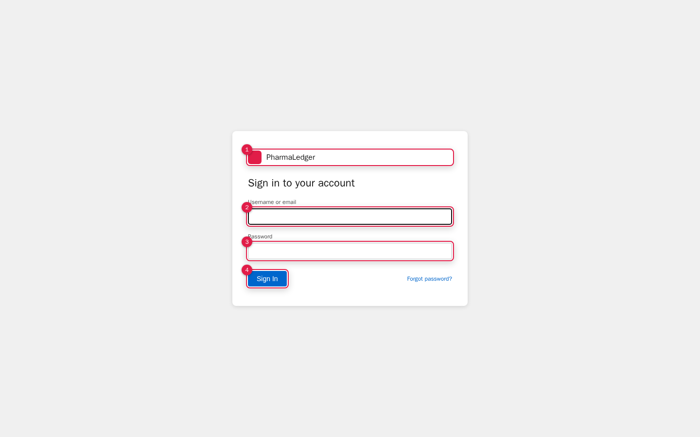 | **Keycloak sign-in**  Opening the wallet starts the Keycloak single sign-on flow, which lands on the identity provider's sign-in screen. The user signs in with their network credentials; the wallet never receives or stores the password.  - **1** PharmaLedger identity provider. - **2** Username or email. - **3** Password. - **4** **Sign In** submits the credentials and returns the user to the wallet. - Credentials are handled entirely by Keycloak; the wallet only receives the signed token. |
| **Sign in to the wallet**  The sign-in screen is the application landing page. While the wallet checks whether a valid session already exists it shows the PharmaLedger logo; if no session is found the single sign-on flow starts automatically. The **Login** button is the manual fallback for the rare case where the automatic redirect is blocked.  - **1** Application logo. - **2** Authentication status prompt. - **3** **Login** button, the manual fallback that starts the Keycloak single sign-on flow. - The application never asks for a username or password directly: credentials are handled by the Keycloak identity provider. - A signed-in session lasts one hour; the wallet refreshes it transparently in the background. | 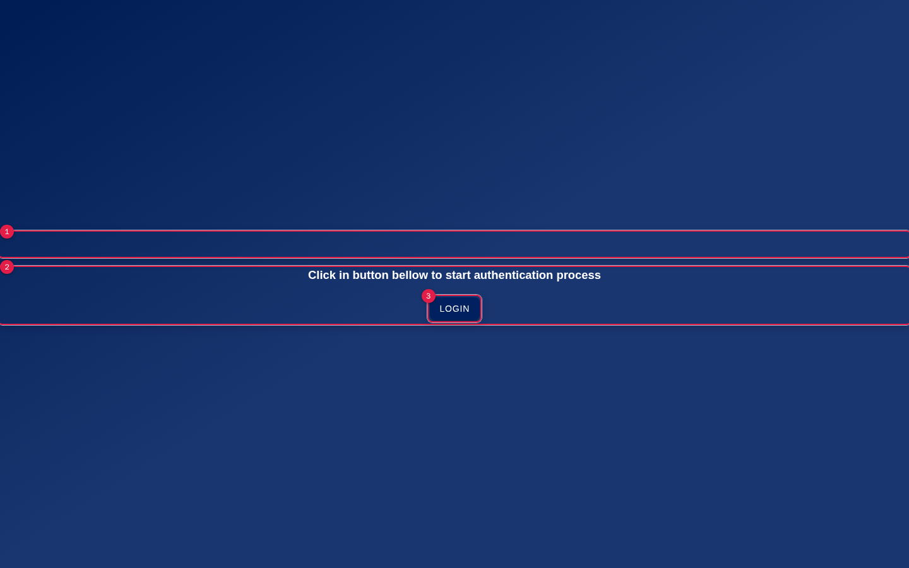 |
| 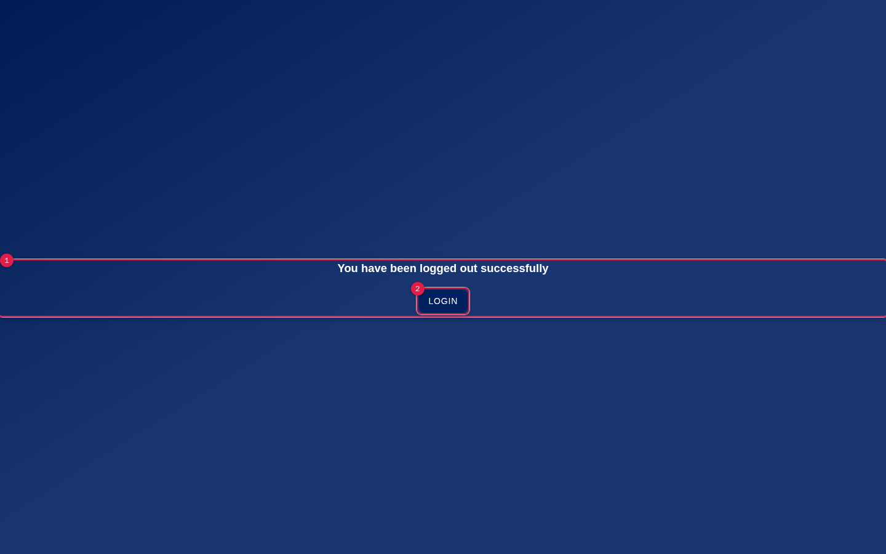 | **Signed out**  After signing out, the wallet returns to the sign-in screen with a confirmation message and the **Login** button, so the user can start a new session.  - **1** Signed-out confirmation. - **2** **Login** button. |
| **Dashboard**  The dashboard is the home screen of the wallet. It embeds the Kibana control panel used to inspect the network, and shares the application shell (header, menu and account avatar) with every other authenticated page.  - **1** Application header, with the operation shortcuts and the account avatar. - **2** Kibana control panel. - The embedded dashboard is read-only; all wallet operations are performed from the side menu. | 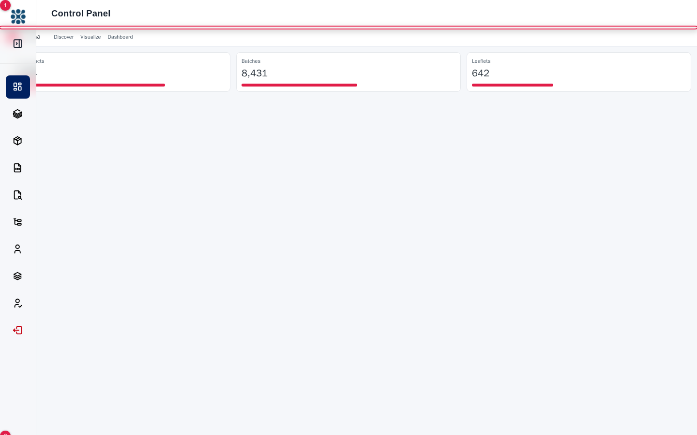 |
| 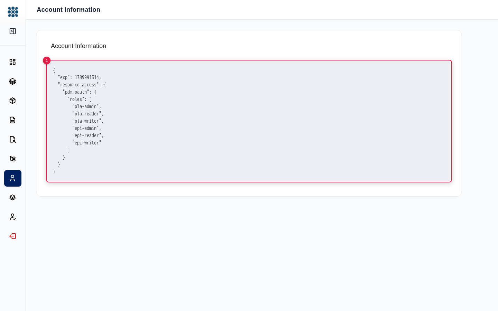 | **Account**  The account screen shows the profile decoded from the current Keycloak token: the subject, the organisation, the namespace and the roles the account holds. It is reachable from the avatar in the top-right corner.  - **1** Decoded account and roles. - The account screen is read-only; roles are assigned by the network administrator in Keycloak. |

# Products

The Products section is the entry point of the wallet. A product is identified by its GTIN
(`productCode`), described by an invented name and the medicinal product name, and carries an optional
internal material code, a product image, a recall flag, strengths and markets. Products are the parent entity of batches
and ePI documents.

The product screens are reachable from the **Products & Batches** entry in the side menu. The list supports searching,
sorting and paging; the read screen is read-only; the create and update screens use the shared
model renderer with a *SHOW FORM* action that expands the repeatable strengths and markets sections.

| | |
| :---: | :--- |
| 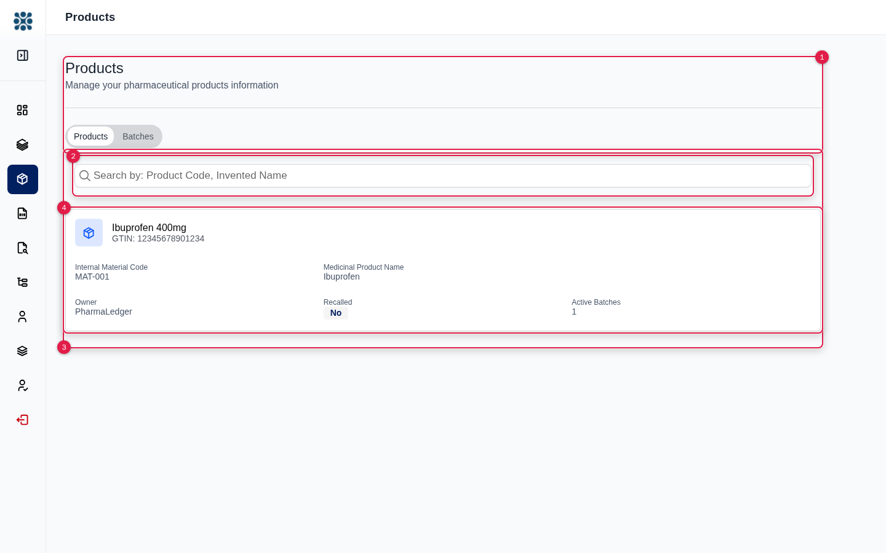 | **Product list**  The product list is the entry point of the Products section. Each row shows the product GTIN, invented name and medicinal product name. The list is searched with the search bar, sorted and paged, and new products are created from the header action.  - **1** Page title, tabs and actions. - **2** Search bar. - **3** Product list. - **4** Product row. - Selecting a row opens the read-only product details. - The list only shows the products the signed-in account is allowed to see. |
| **Create a product — identity**  The create-product form collects the product identity and description. The GTIN (`productCode`) is validated, the invented name and medicinal product name are required, and the internal material code is optional.  - **1** GTIN (`productCode`). - **2** Invented name. - **3** Medicinal product name. - **4** Internal material code. - The form continues with the product image and recall flag, then the strengths and markets sections. | 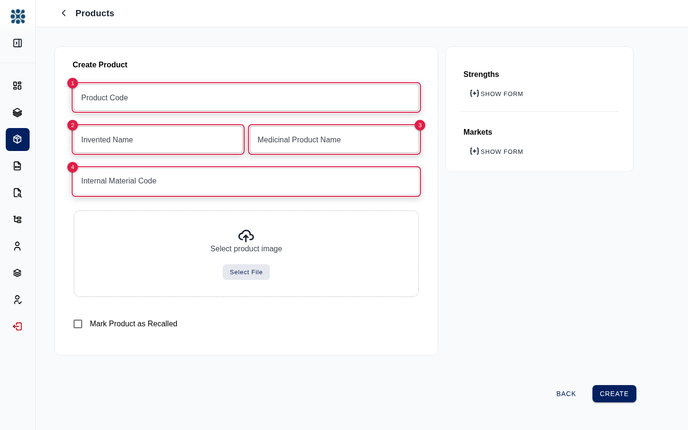 |
| 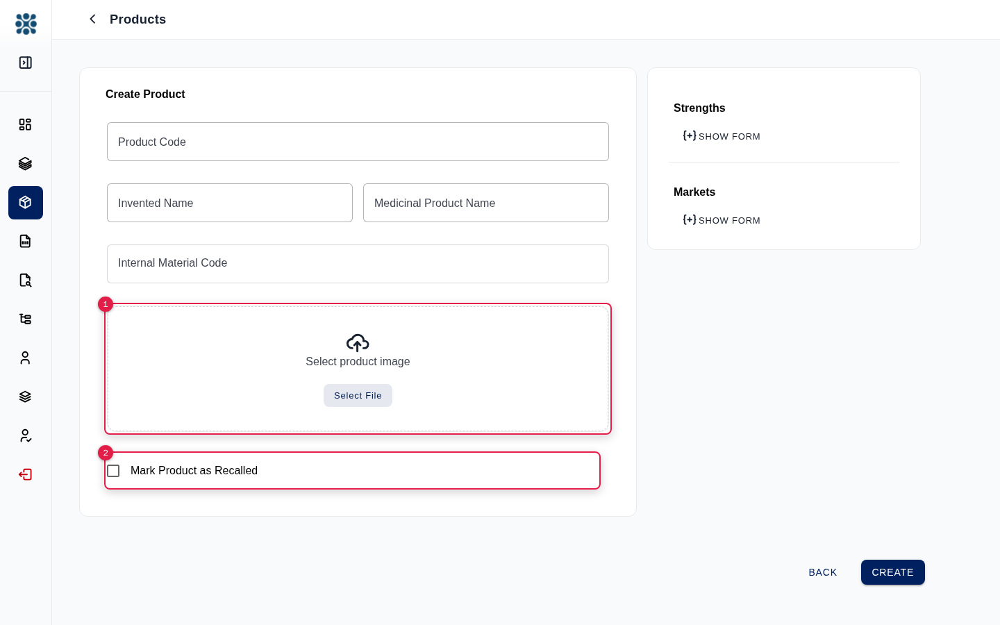 | **Create a product — image and recall**  The product image is uploaded from the local file system and the **product recall** switch marks the product as recalled. The image is optional but, when set, is propagated to the PTP cache.  - **1** Product image upload. - **2** Product recall switch. |
| **Create a product — strengths**  The **strengths** section lists the active substance strengths of the product. It is repeatable: select **SHOW FORM** to add a strength, fill in the substance and the strength, and remove entries individually.  - **1** Strength section, with the **SHOW FORM** switch and the strength form. - **2** Active substance. - **3** Strength value. - A product can carry more than one strength; each one is listed separately. | 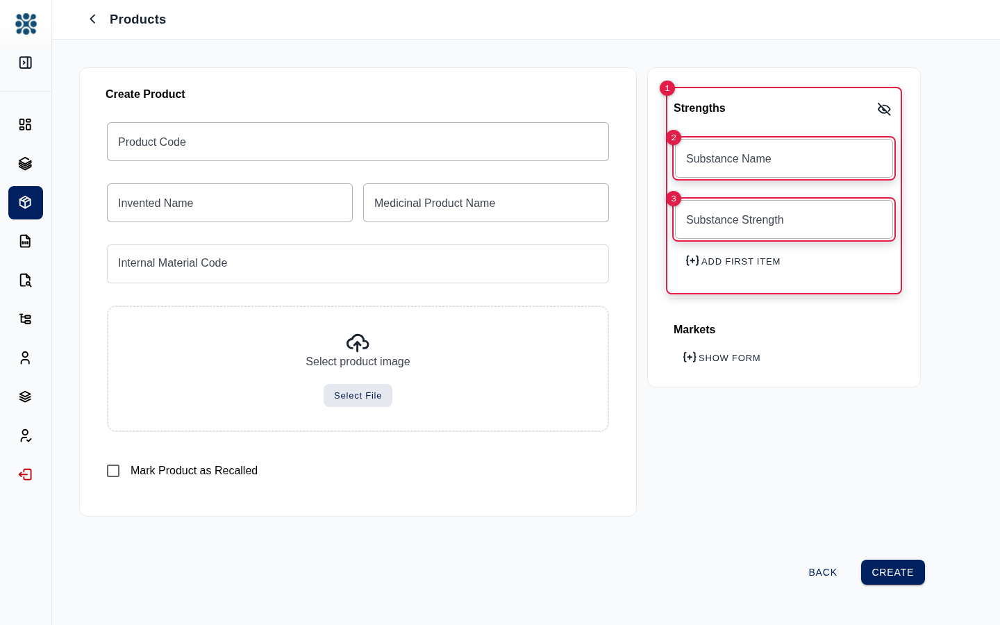 |
| 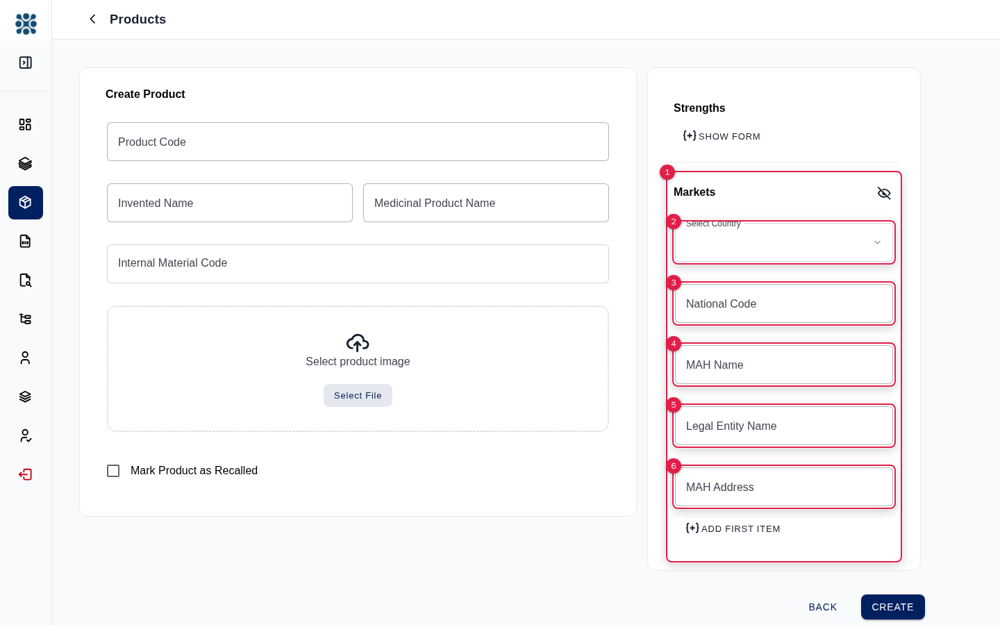 | **Create a product — markets**  The **markets** section lists the markets in which the product is placed. It is repeatable in the same way as the strengths section, and records the national code, the marketing authorisation holder and its address.  - **1** Market section, with the **SHOW FORM** switch and the market form. - **2** Market. - **3** National code. - **4** Marketing authorisation holder name. - **5** Legal entity name. - **6** Marketing authorisation holder address. |
| **Create a product — actions**  The **CREATE** action submits the form; **BACK** returns to the list without saving.  - **1** **CREATE** submits the product. - **2** **BACK** returns to the list without saving. | 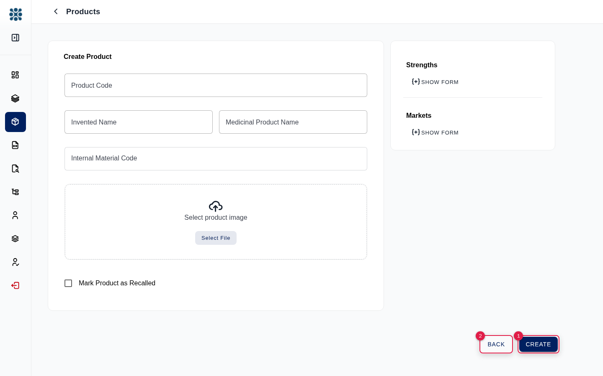 |
| 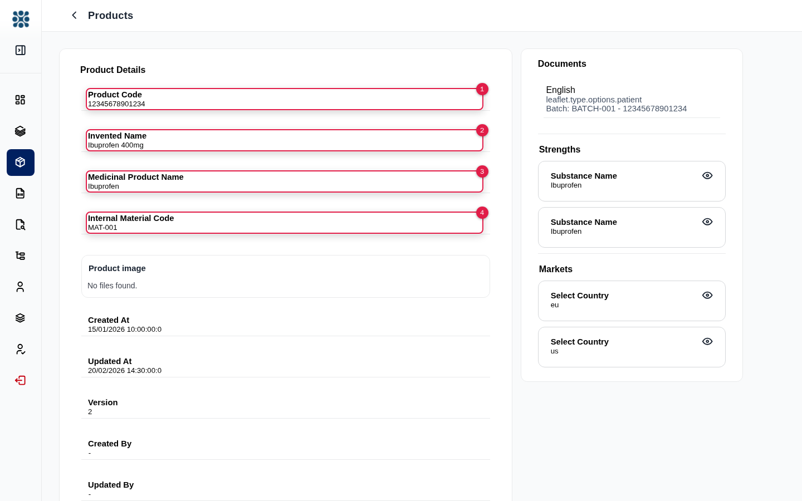 | **Product details**  The read-only product details show the product identity and description: the GTIN, the invented name, the medicinal product name, the internal material code, the image and the recall status. The header shortcuts open the update form or return to the list.  - **1** GTIN. - **2** Invented name. - **3** Medicinal product name. - **4** Internal material code. - The image and recall status, and the attached ePI documents, strengths and markets, are shown further down the page. - The GTIN is the identifier used to link batches and ePI documents to the product. |
| **Product details — ePI documents**  The **ePI documents** list shows the patient and prescribing documents attached to the product, with their batch, language, market and owner. Selecting a document opens its read-only details.  - **1** ePI documents attached to the product. - The list is empty until at least one ePI document is created for the product. | 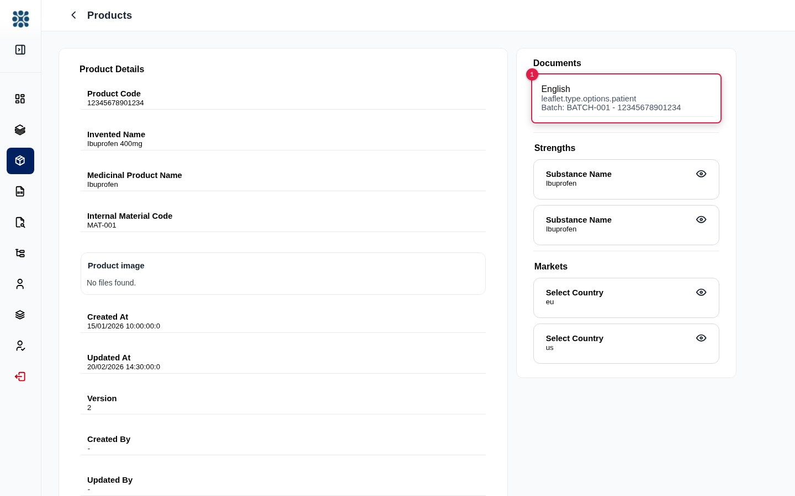 |
| 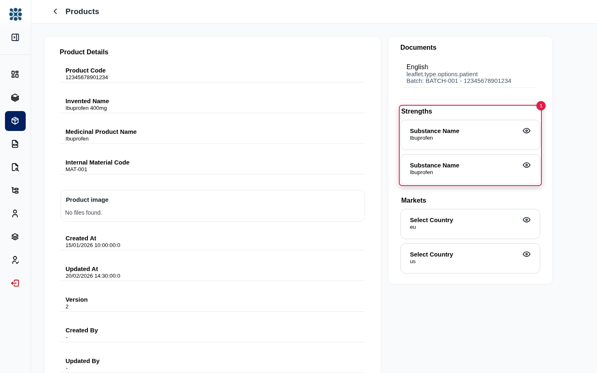 | **Product details — strengths**  The **strengths** section lists the active substance strengths of the product.  - **1** Strengths attached to the product. |
| **Product details — markets**  The **markets** section lists the markets in which the product is placed, with the national code and the marketing authorisation holder.  - **1** Markets attached to the product. | 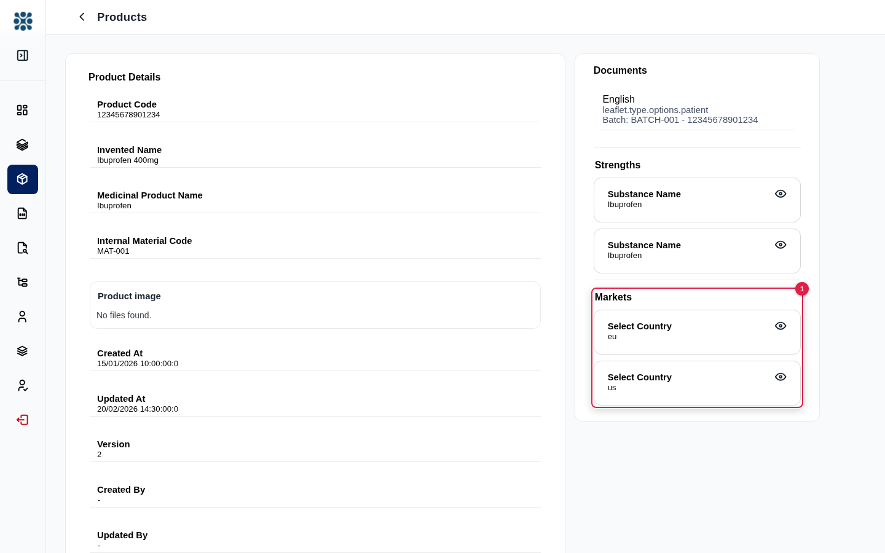 |
| 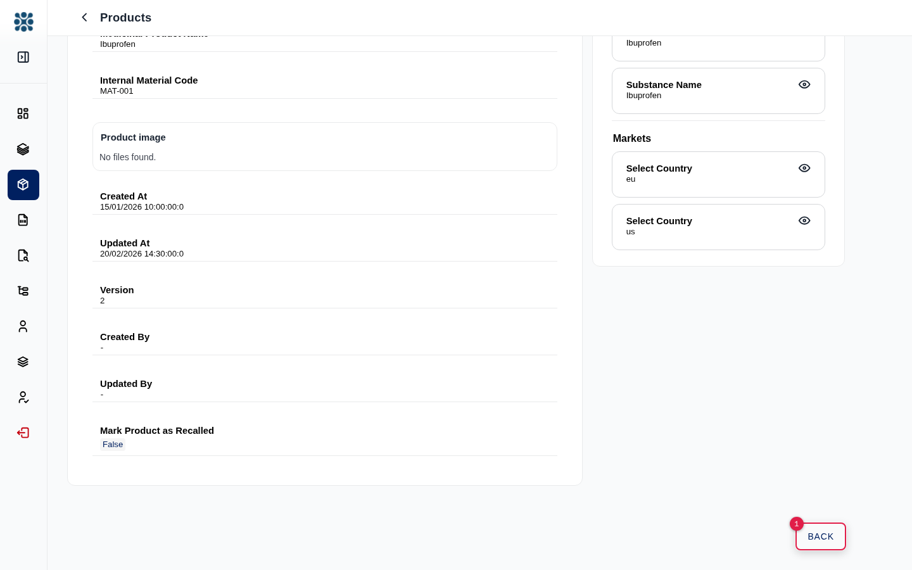 | **Product details — actions**  **BACK** returns to the product list.  - **1** **BACK** returns to the product list. |
| **Update a product — fields**  The update form is the create form pre-filled with the current product. The GTIN is read-only, the remaining fields become editable, and the product image can be replaced.  - **1** Editable invented name. - **2** Editable medicinal product name. - **3** Editable internal material code. - The GTIN is read-only; the attached ePI documents, strengths and markets are listed further down the form. | 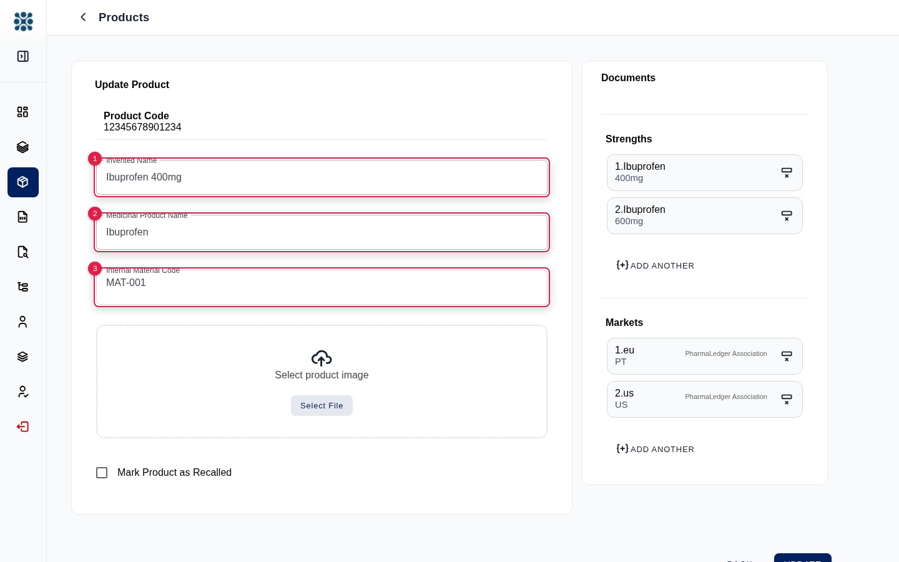 |
| 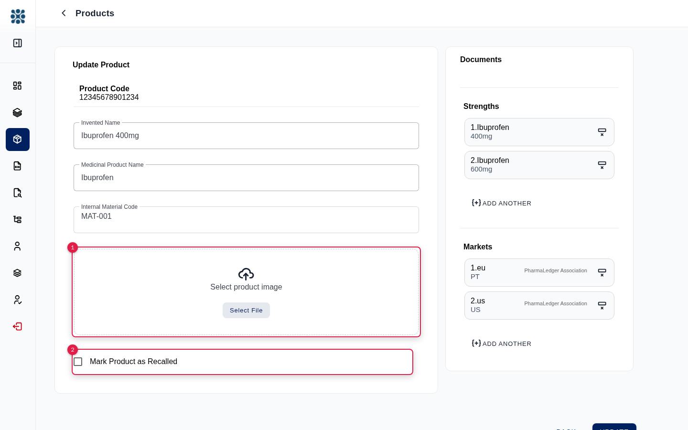 | **Update a product — image and recall**  The product image can be replaced from the local file system and the **product recall** switch marks the product as recalled.  - **1** Product image upload. - **2** Product recall switch. |
| **Update a product — strengths**  The **strengths** section lists the strengths already attached to the product. A new strength is added with **SHOW FORM** and existing entries are removed individually.  - **1** Strength section, with the **SHOW FORM** switch and the strength form. - **2** Active substance. - **3** Strength value. | 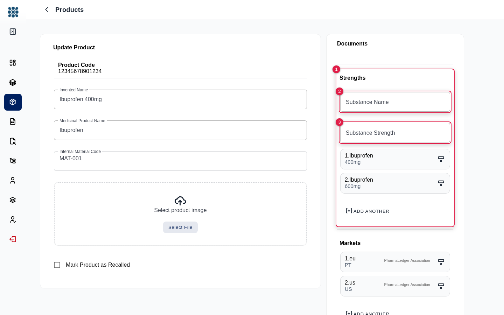 |
| 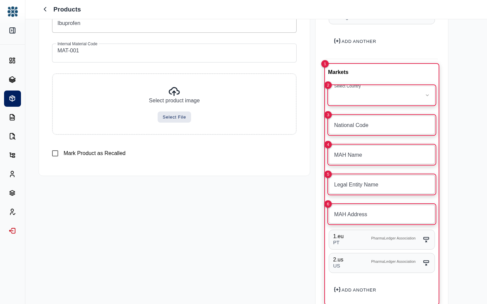 | **Update a product — markets**  The **markets** section lists the markets already attached to the product. A new market is added with **SHOW FORM** and existing entries are removed individually.  - **1** Market section, with the **SHOW FORM** switch and the market form. - **2** Market. - **3** National code. - **4** Marketing authorisation holder name. - **5** Legal entity name. - **6** Marketing authorisation holder address. |
| **Update a product — ePI documents**  The **ePI documents** list shows the patient and prescribing documents attached to the product.  - **1** ePI documents attached to the product. | 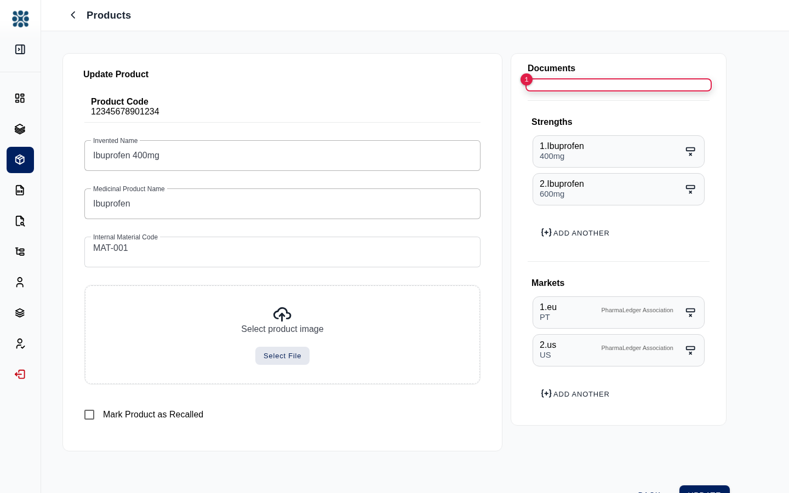 |
| 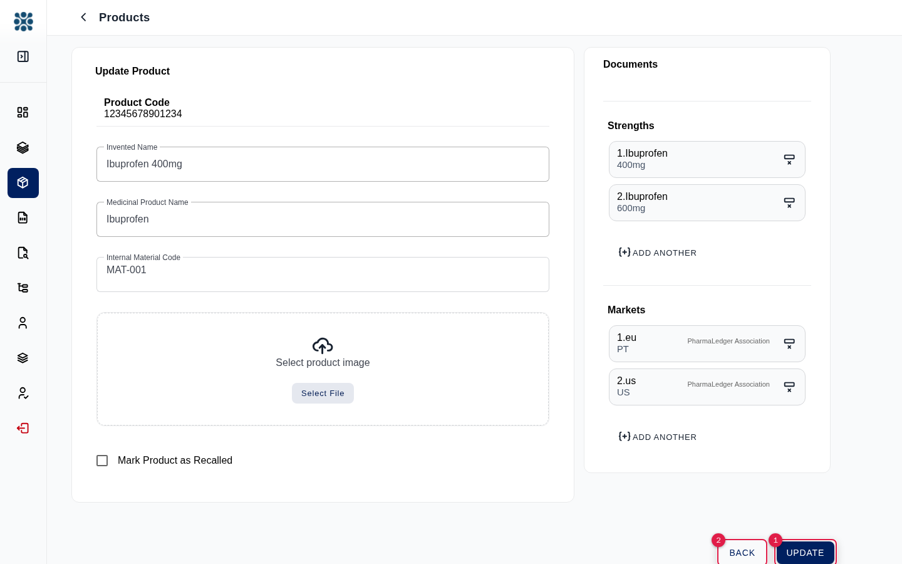 | **Update a product — actions**  **UPDATE** opens the change confirmation modal, which shows exactly what changed before the update is confirmed and persisted (and written to the audit log). **BACK** returns to the list without saving.  - **1** **UPDATE** opens the change confirmation modal. - **2** **BACK** returns to the list without saving. |

# Batches

The Batches section manages the production batches of a product. A batch is identified by the product GTIN
plus a batch number, and carries import licence, packaging site, expiry, manufacturing and recall information. A batch
inherits the product's ePI documents, so the batch read screen also lists the leaflets attached to its product.

| | |
| :---: | :--- |
| 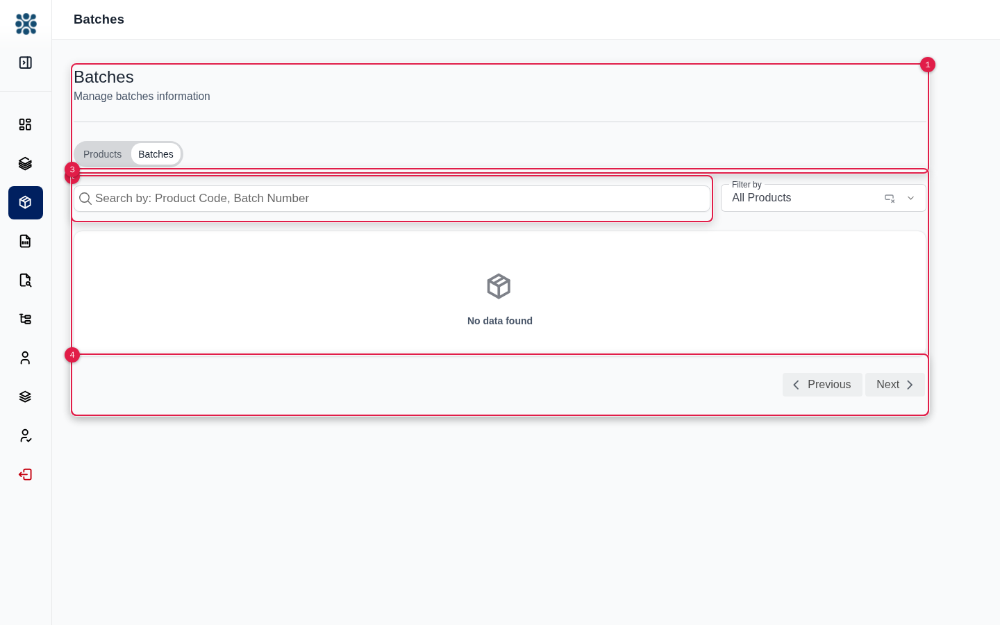 | **Batch list**  The batch list shows one row per product with the number of batches it has. From here a batch is opened, created or searched.  - **1** Page title, tabs and actions. - **2** Search bar. - **3** Batch table. - **4** Pagination. - The list is empty until at least one product exists; the empty state links directly to the product create form. |
| **Add a batch — identity**  The add-batch form collects the batch identity: the medicinal product name, the invented name and the batch number. The product names are read-only, because they are inherited from the product selected from the product screen.  - **1** Medicinal product name. - **2** Invented name. - **3** Batch number. | 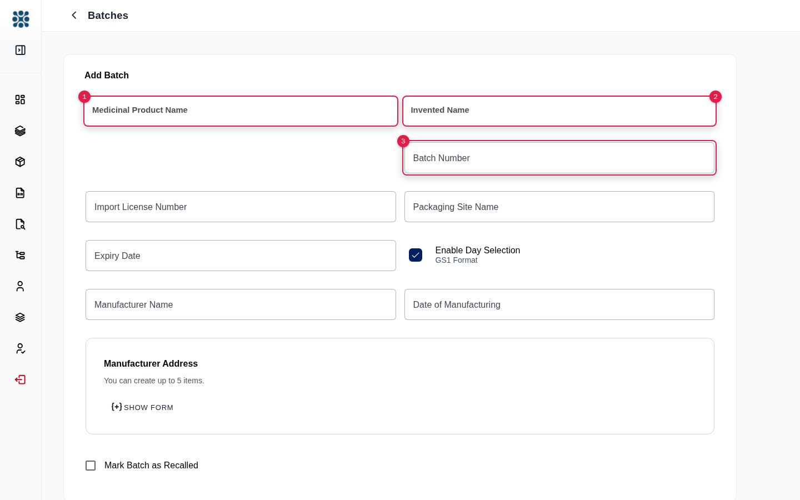 |
| 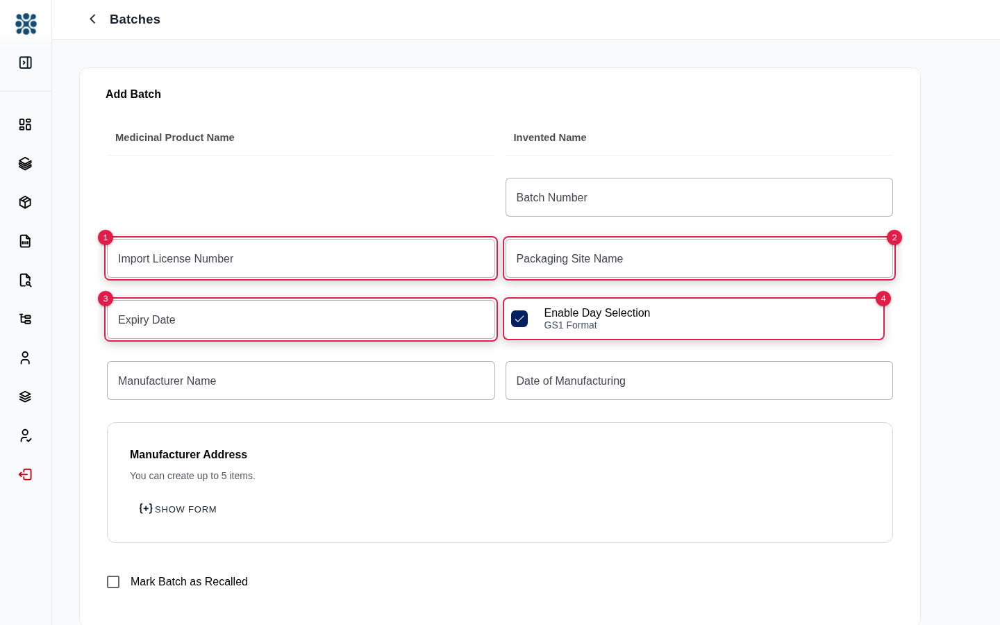 | **Add a batch — import and packaging**  The import and packaging details identify the licence under which the batch was imported, the packaging site and the expiry date. **Enable day selection** allows the expiry date to be specified to the day rather than the month.  - **1** Import licence number. - **2** Packaging site name. - **3** Expiry date. - **4** **Enable day selection** switch. |
| **Add a batch — manufacturing details**  The manufacturing section collects the manufacturer name, the date of manufacturing and the manufacturer address. The address is repeatable: expand it with **SHOW FORM** and remove entries individually.  - **1** Manufacturer name. - **2** Date of manufacturing. - **3** Manufacturer address section, with the **SHOW FORM** switch. - **4** Address line. | 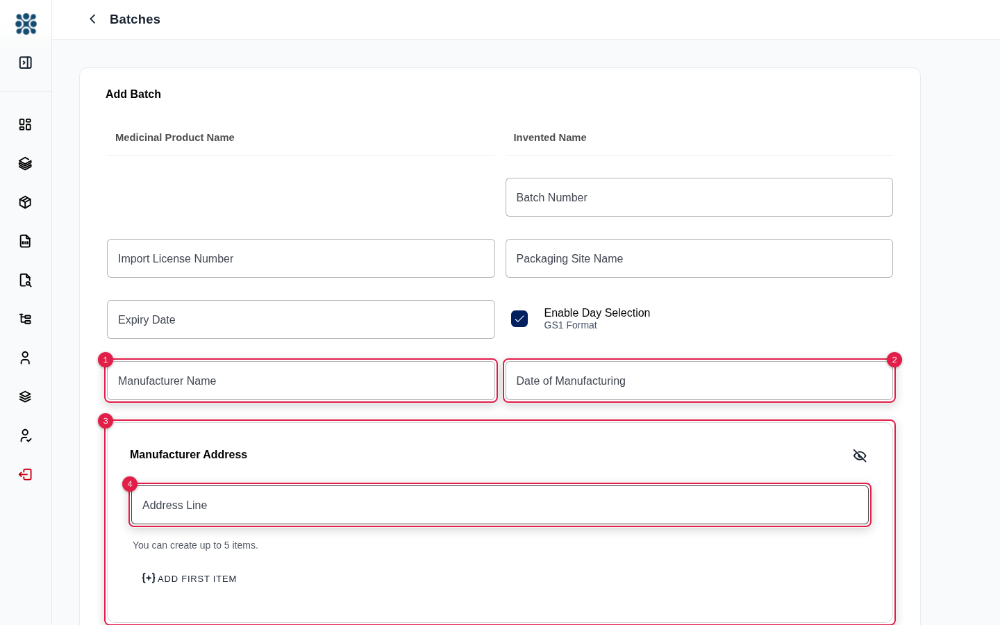 |
| 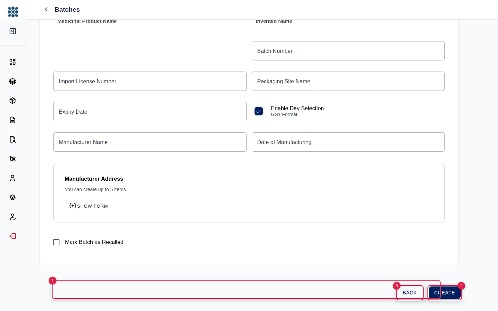 | **Add a batch — recall and actions**  **Mark batch as recalled** flags the batch as recalled. **CREATE** submits the batch; **BACK** returns to the list without saving.  - **1** **Mark batch as recalled** switch. - **2** **CREATE** submits the batch. - **3** **BACK** returns to the list without saving. |
| **Batch details**  The read-only batch details show the product GTIN, the batch number, the medicinal and invented product names, and the import, packaging and manufacturing information.  - **1** Product GTIN. - **2** Batch number. - **3** Medicinal product name. - **4** Invented name. - The generated data matrix and the recall status are shown further down the form. | 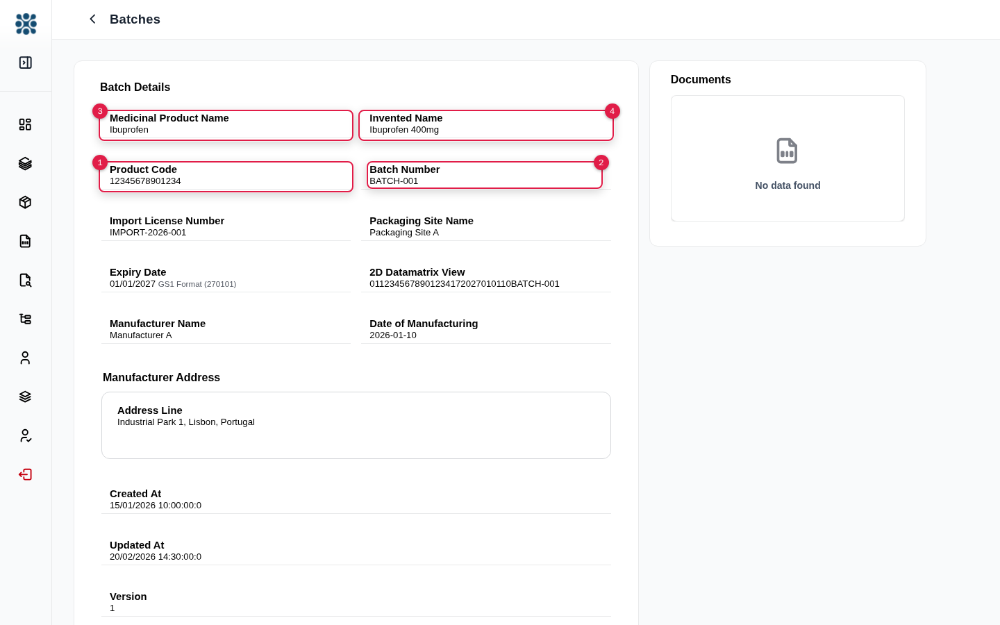 |
| 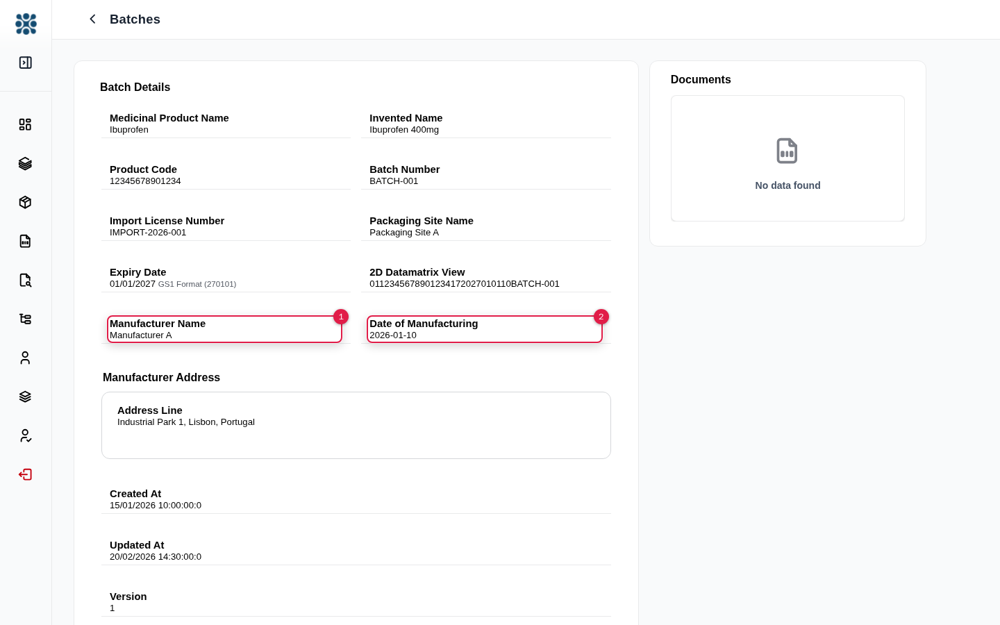 | **Batch details — manufacturing**  The manufacturing section of the batch details shows the manufacturer name, the date of manufacturing and the manufacturer address.  - **1** Manufacturer name. - **2** Date of manufacturing. - The manufacturer address is shown on the update form; the read screen shows the values as text. |
| **Batch details — ePI documents**  The ePI documents attached to the product of the batch are listed below the form.  - **1** ePI documents attached to the product of the batch. | 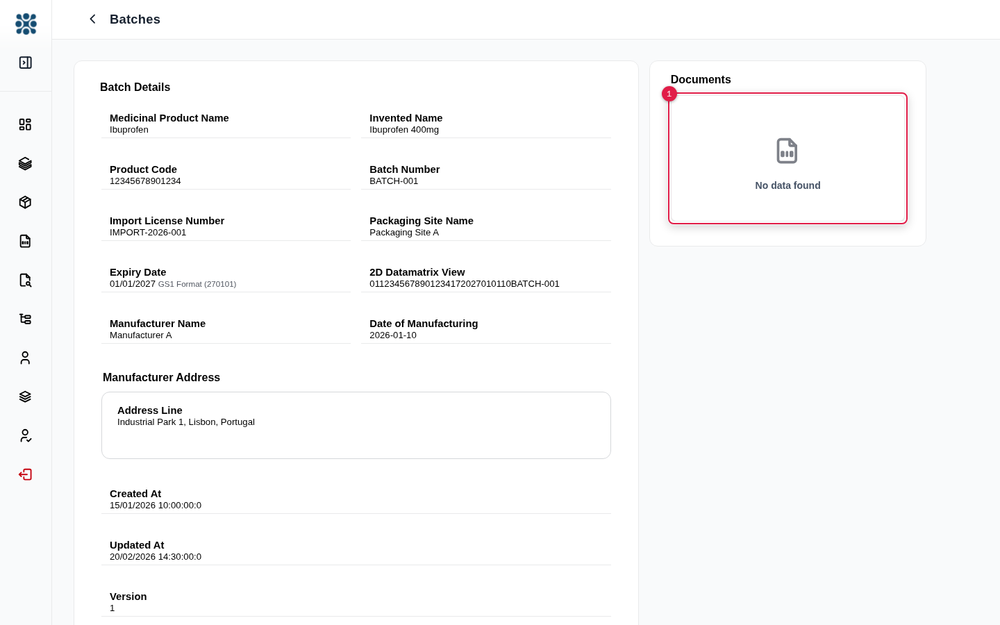 |
| 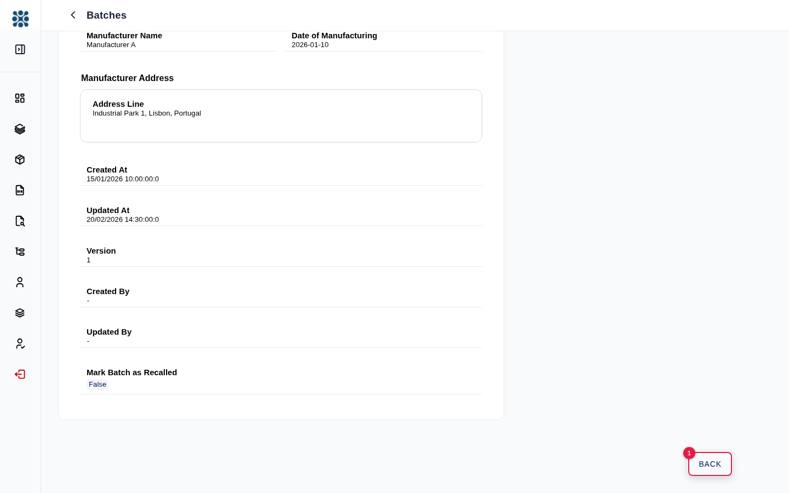 | **Batch details — actions**  **BACK** returns to the batch list.  - **1** **BACK** returns to the batch list. |
| **Update a batch — fields**  The update form is the add-batch form pre-filled with the current batch. The product and batch number are read-only and the remaining fields become editable.  - **1** Read-only batch number. - **2** Editable import licence number. - **3** Editable packaging site name. - **4** Editable expiry date. | 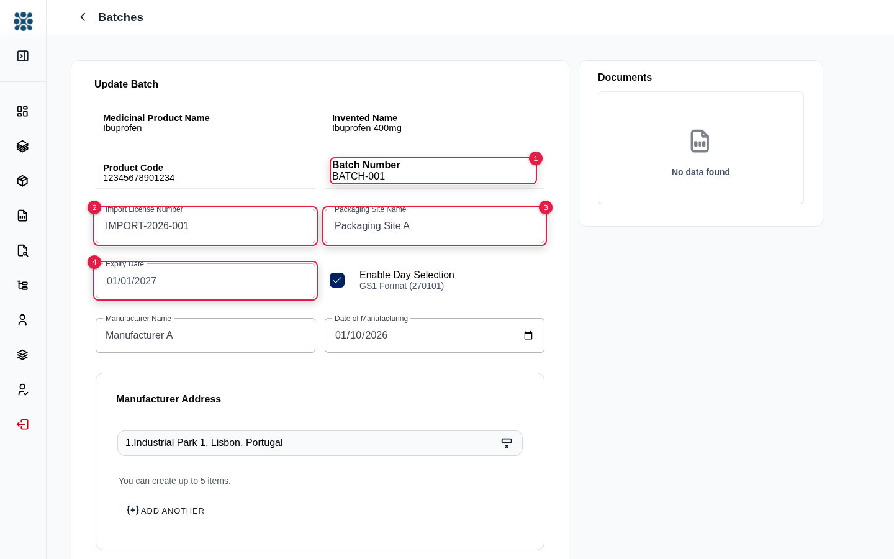 |
| 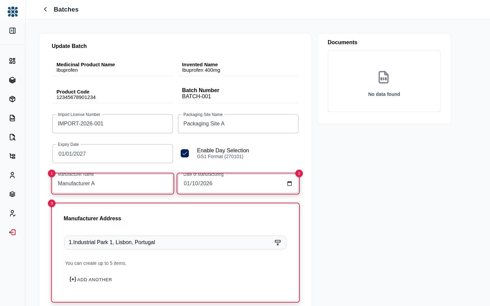 | **Update a batch — manufacturing**  The manufacturing section collects the manufacturer name, the date of manufacturing and the manufacturer address.  - **1** Editable manufacturer name. - **2** Editable date of manufacturing. - **3** Manufacturer address section. |
| **Update a batch — recall and actions**  **Mark batch as recalled** flags the batch as recalled. **UPDATE** opens the change confirmation modal, which shows exactly what changed before the update is confirmed and persisted. **BACK** returns to the list without saving.  - **1** **Mark batch as recalled** switch. - **2** **UPDATE** opens the change confirmation modal. - **3** **BACK** returns to the list without saving. | 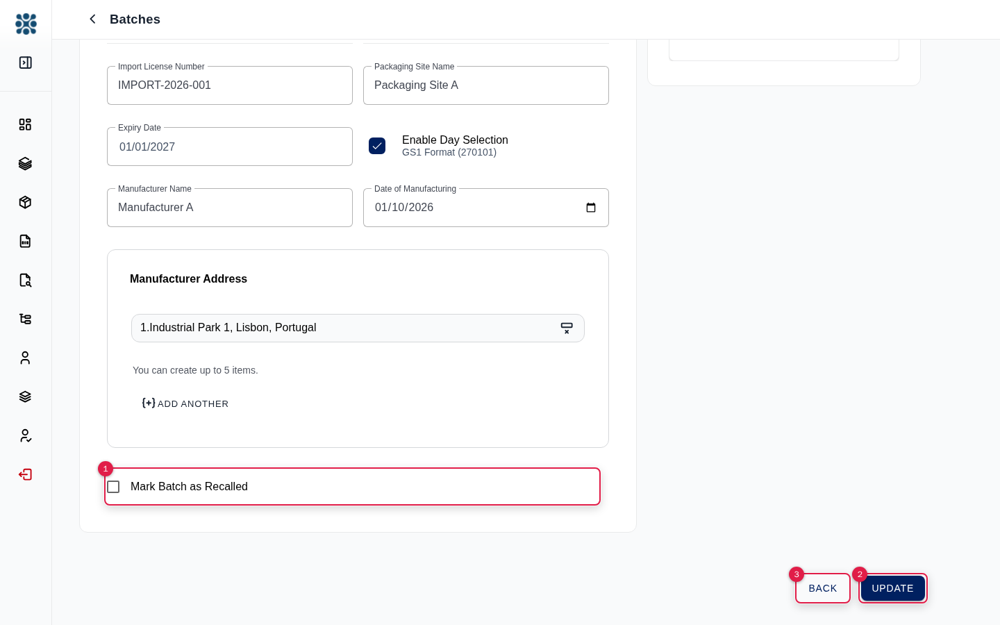 |

# ePI documents

ePI documents (electronic product information, "leaflets") are the patient and prescribing documents
attached to a product/batch pair for a language and market. The list shows the document type, language, market and owner;
the create screen uploads a local XML document or registers an external document by URL, and the read screen lists the
attached documents and external files.

| | |
| :---: | :--- |
| 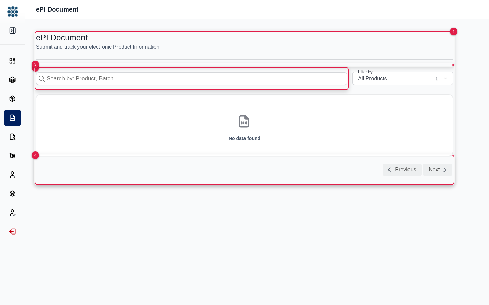 | **ePI document list**  The ePI document list shows one row per uploaded document with its product, batch, document type, language, market and owner. Documents are searched, filtered, paged and opened from here.  - **1** Page title, tabs and actions. - **2** Search bar. - **3** Document table. - **4** Pagination. - The empty state links directly to the product create form when no product exists yet. |
| **Create an ePI document — classification**  The create-ePI form attaches a patient or prescribing document to a product and batch for a language and market.  - **1** Document type (patient or prescribing). - **2** Language. - **3** Market. | 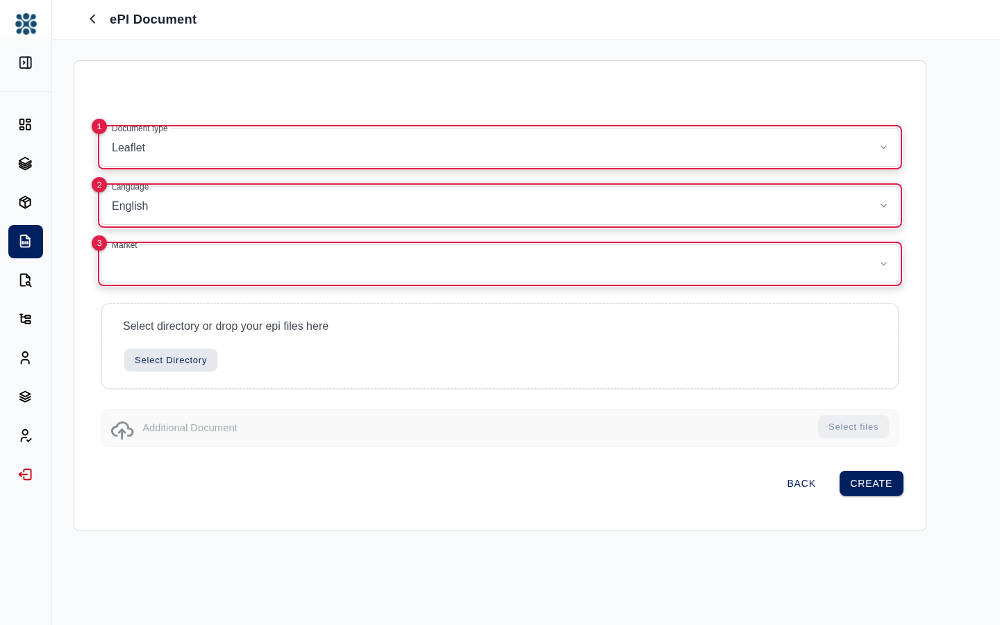 |
| 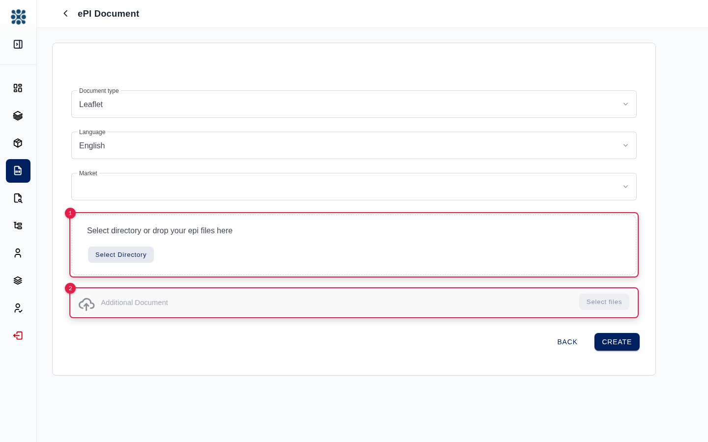 | **Create an ePI document — documents**  The main document can be uploaded from the local file system as a directory or as individual files. Additional external documents (video, image or PDF) can be registered alongside it.  - **1** Local document upload (**Select Directory** / **Select files**). - **2** Additional external documents. |
| **Create an ePI document — actions**  **CREATE** submits the document; **BACK** returns to the list without saving.  - **1** **CREATE** submits the document. - **2** **BACK** returns to the list without saving. | 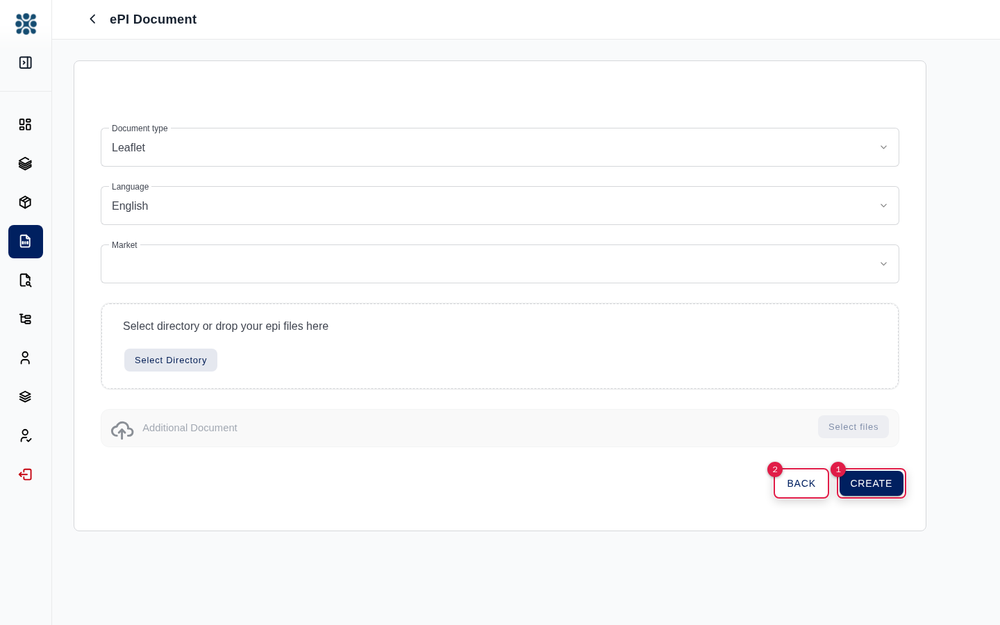 |
| 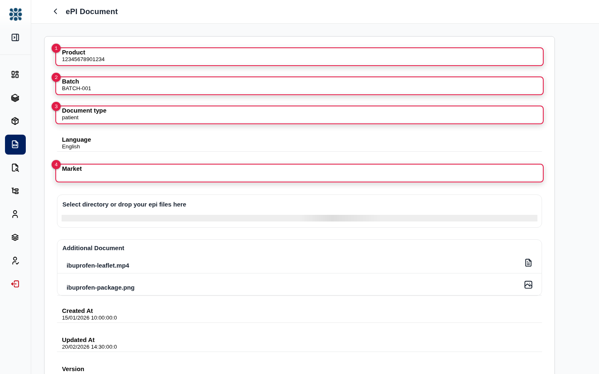 | **ePI document details**  The read-only ePI details show the product, batch, document type, language and market the document is attached to.  - **1** Product. - **2** Batch. - **3** Document type. - **4** Market. - The uploaded document and the attached external files are listed further down the form. |
| **ePI document details — documents**  The uploaded XML document and the additional external documents are listed below the details. Selecting an external document opens a preview.  - **1** Uploaded XML document. - **2** External documents (video, image or PDF). | 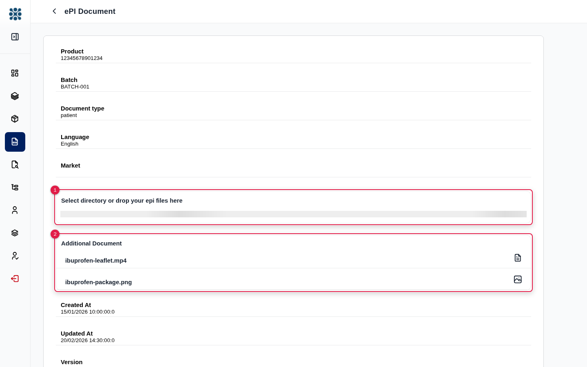 |
| 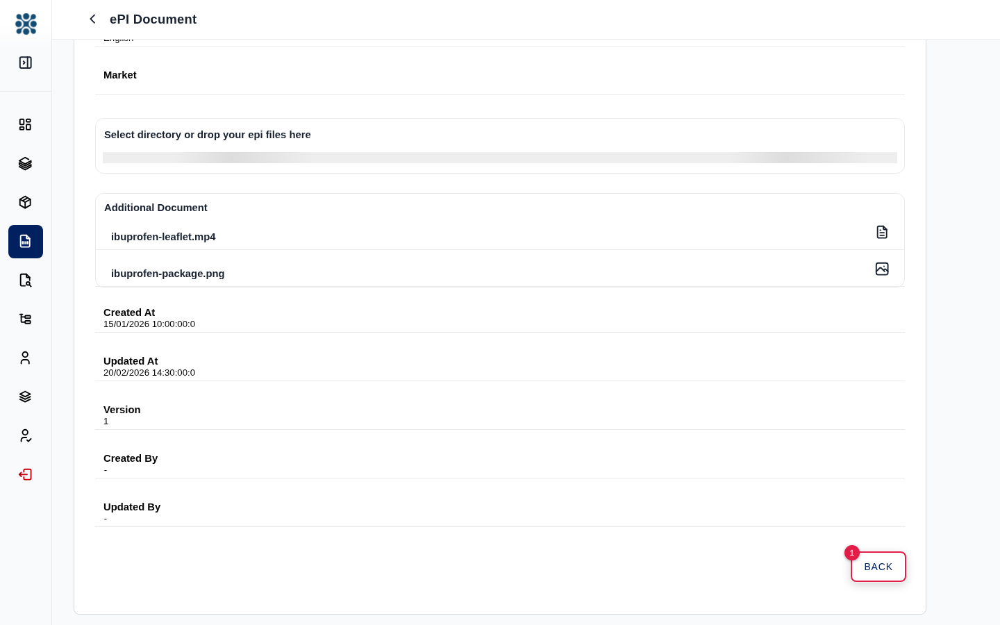 | **ePI document details — actions**  **BACK** returns to the ePI document list.  - **1** **BACK** returns to the ePI document list. |

# Audit logs

The Audit section is a read-only, append-only ledger of every create, update and delete performed on the
wallet. It supports searching, sorting and paging, and can be exported to CSV.

| | |
| :---: | :--- |
| 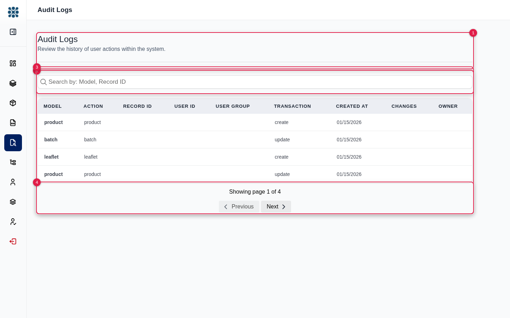 | **Audit logs**  The audit table lists every create, update and delete performed on the wallet, with the user, group, transaction, action and model. The list is searched, sorted, paged and exported to CSV.  - **1** Page title and CSV export. - **2** Search bar. - **3** Audit table. - **4** Pagination. - The export button downloads the currently filtered rows as a CSV file. |

# Tasks

The Tasks section tracks the asynchronous jobs the wallet runs (for example product metadata
propagation to the PTP cache). Tasks are only shown to PLA accounts.

| | |
| :---: | :--- |
| 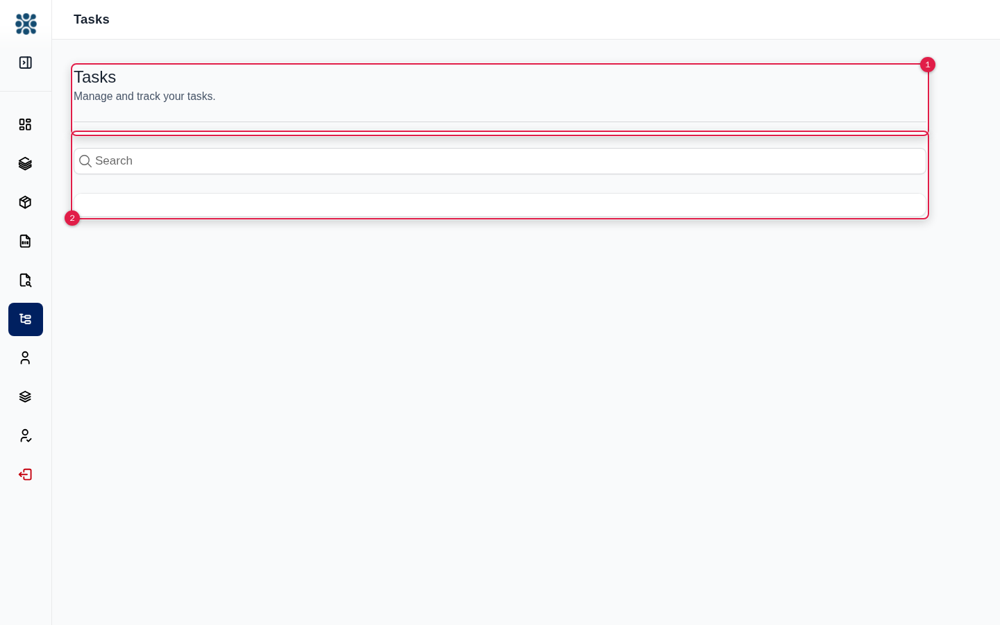 | **Tasks**  The task table lists the asynchronous jobs the wallet runs and their status (pending, running, completed, failed), with the number of attempts. Tasks are only shown to PLA accounts.  - **1** Page title. - **2** Task table. |

# Administration

The Administration section is only reachable by PLA administrators. It manages the organisation
**enrollments**: the one-time tokens that onboard a new organisation onto the network.

| | |
| :---: | :--- |
| 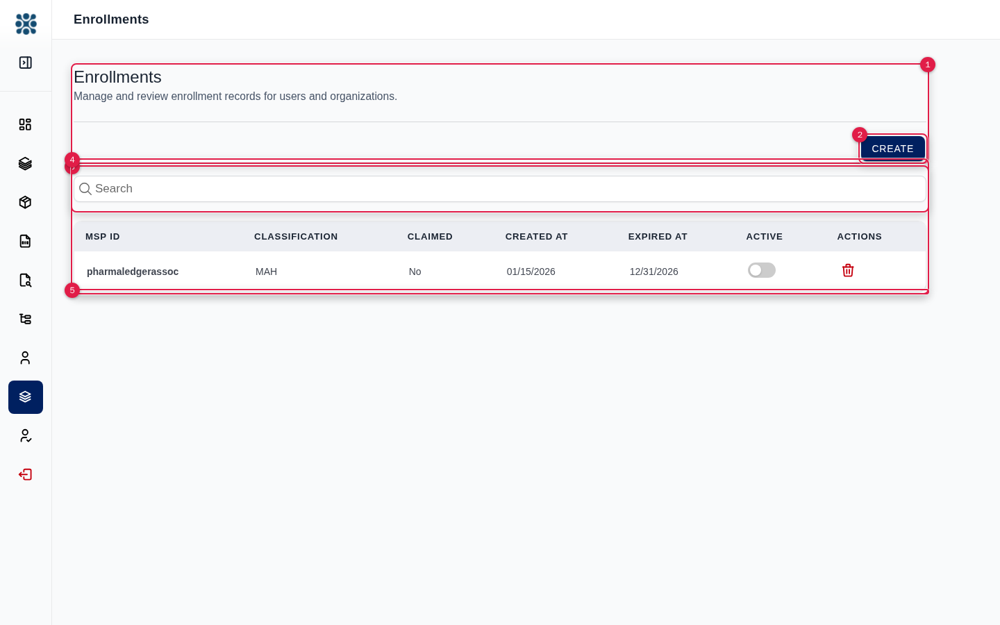 | **Enrollments**  The enrollments table lists the organisations that have been invited to join the network, with their MSP identifier, classification, expiry and claim status. A new enrollment token is created with the **CREATE** action.  - **1** Page title and actions. - **2** **CREATE** enrollment action. - **3** Search bar. - **4** Enrollment table. - **5** Pagination. |
| **Create an enrollment**  The enrollment form issues a one-time token for a new organisation. The MSP identifier identifies the organisation, the classification selects the account type, and the expiry date bounds the token's validity.  - **1** MSP identifier. - **2** Classification. - **3** Expiry date. - **4** **Claimed**, which records whether the token has already been used. - **5** **Active**, which records whether the enrollment is currently active. - **6** **CREATE** issues the token. - **7** **BACK** returns to the list. | 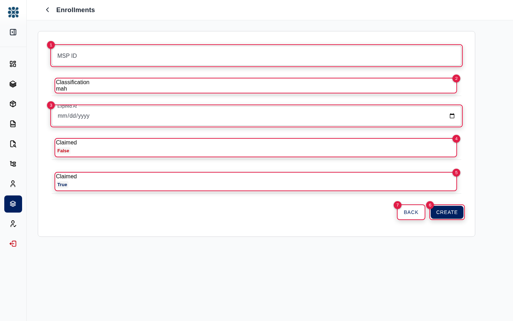 |

# Accounts

The accounts registry holds the organisations already known to the network. Each account record
carries the organisation legal name, its deployment status, the MSP identifier, the backend endpoint, the modules and
features enabled for the account, and the Keycloak client roles assigned to it. Accounts are read-only from the wallet:
they are created and updated by the network administrator in Keycloak.

| | |
| :---: | :--- |
| 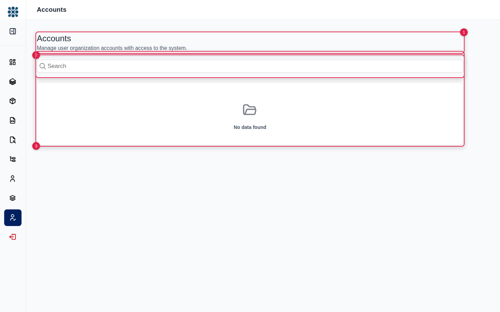 | **Accounts**  The accounts registry lists the organisations already known to the network, with their legal name, deployment status, MSP identifier and backend endpoint. Accounts are read-only from the wallet: they are created and updated by the network administrator in Keycloak. When the registry returns no accounts, the page shows its empty state.  - **1** Page title and description. - **2** Search bar. - **3** Empty state, shown while the registry returns no accounts. - Accounts are created and updated by the network administrator in Keycloak, not from the wallet. |

# Enrollment token

The enrollment token screen validates the token printed on the onboarding letter so the new
organisation can be enrolled into the network.

| | |
| :---: | :--- |
| 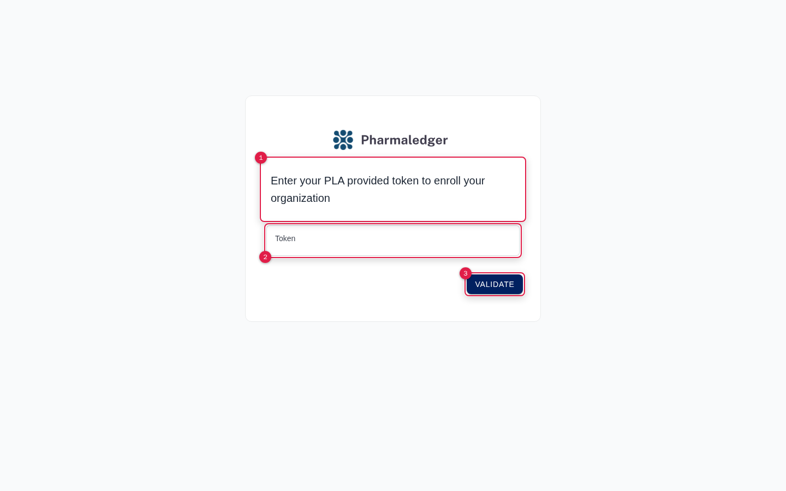 | **Validate an enrollment token**  The token screen validates the one-time enrollment token printed on the onboarding letter. The token is pasted into the field and submitted with **VALIDATE**; a valid token redirects to the enrollment form.  - **1** Page title. - **2** Token field. - **3** **VALIDATE** button. - The token can only be validated once. - After validation the organisation completes its own account details in the enrollment form. |
| **Complete the enrollment — organisation**  After a valid token is accepted, the organisation completes its own account details in the enrollment form: the legal name and the network endpoints.  - **1** Legal name of the organisation. - **2** Backend endpoint used by the wallet to reach the organisation backend. - The MSP identifier and the module and feature switches are pre-set by the token. | 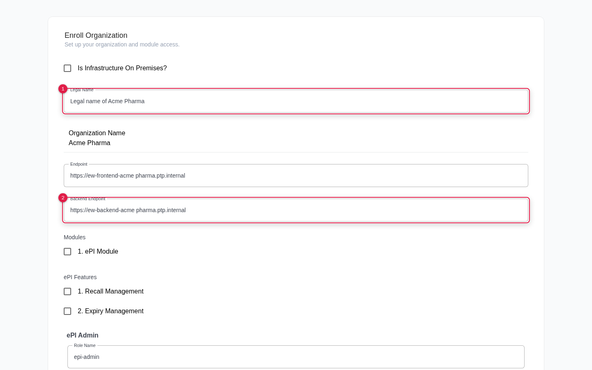 |
| 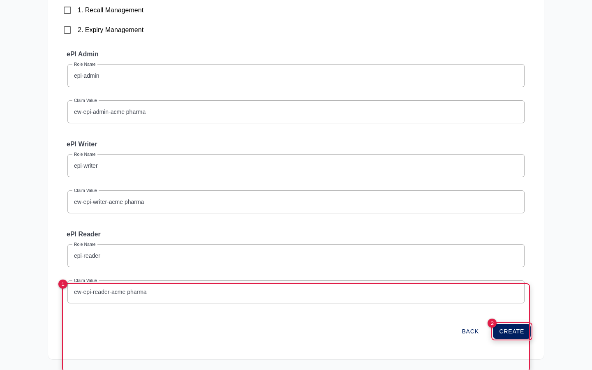 | **Complete the enrollment — roles**  The organisation then picks the Keycloak client roles it will use and submits the enrollment with **Create**.  - **1** Keycloak client roles granted to the organisation (ePI administrator, writer and reader). - **2** **Create** submits the enrollment. - The MSP identifier and the module and feature switches are pre-set by the token. |

# Errors and empty states

The application surfaces a generic error page for blocked operations and unexpected failures,
and an empty state when a list has no data or when a prerequisite (a product) does not exist yet.

| | |
| :---: | :--- |
| 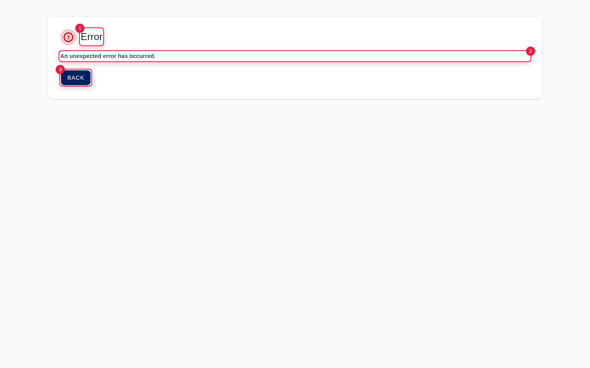 | **Error page**  The error page is shown when an operation is blocked by the account's roles or when a page cannot be loaded. It explains the failure and offers **BACK** to return to the previous screen.  - **1** Error title. - **2** Error message. - **3** **BACK** returns to the previous screen. |
| **Not found**  A blocked or unknown operation (for example deleting a product, which the wallet does not allow) redirects to the error page with the *not found* message.  - **1** Error title. - **2** Error message. - **3** **BACK** returns to the previous screen. |  |
| 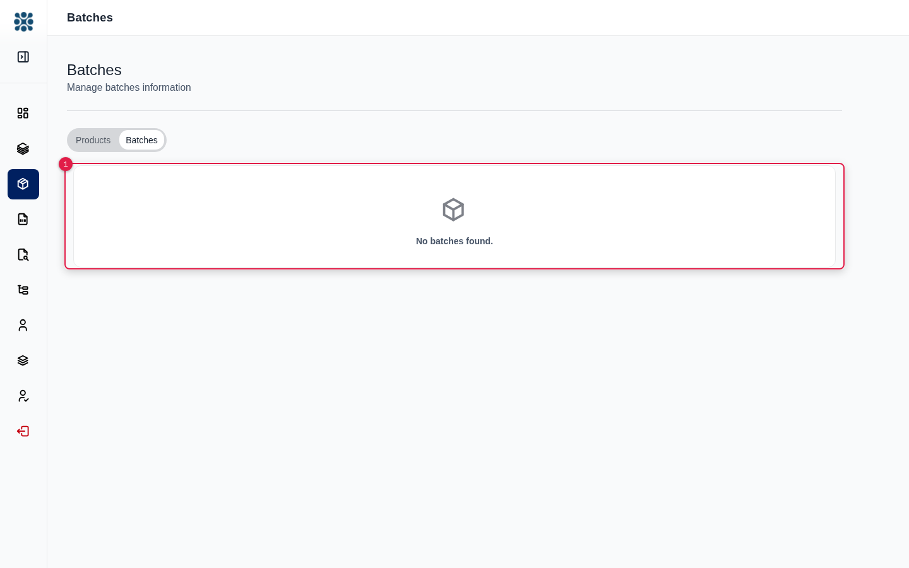 | **Empty list**  When a list has no data yet, the application shows a consistent empty state: a message explaining that there are no records to show.  - **1** Empty state, shown when the list has no data. |
